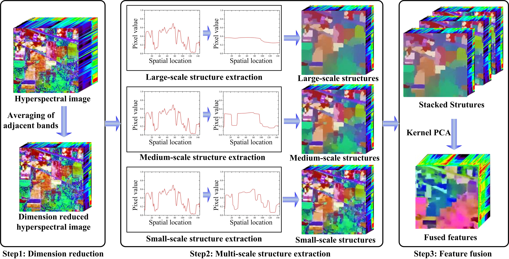

# Matlab Code for Noise-Robust Hyperspectral Image Classification via Multi-Scale Total Variation

[Puhong Duan](https://scholar.google.ch/citations?hl=en&user=IYUlx_8AAAAJ&view_op=list_works&sortby=pubdate), [Xudong Kang](https://scholar.google.ch/citations?user=5XOeLZYAAAAJ&hl=en), [Shutao Li](https://scholar.google.ch/citations?user=PlBq8n8AAAAJ&hl=en), [Pedram Ghamisi](https://scholar.google.ch/citations?user=Gr9afd0AAAAJ&hl=en)

___________

The code in this toolbox implements the ["Noise-Robust Hyperspectral Image Classification via Multi-Scale Total Variation"](https://ieeexplore.ieee.org/document/8725896). More specifically, it is detailed as follow.

Citation
---------------------

**Please kindly cite the papers if this code is useful and helpful for your research.**

P. Duan, X. Kang, S. Li and P. Ghamisi, "Noise-Robust Hyperspectral Image Classification via Multi-Scale Total Variation," in IEEE Journal of Selected Topics in Applied Earth Observations and Remote Sensing, vol. 12, no. 6, pp. 1948-1962, June 2019, doi: 10.1109/JSTARS.2019.2915272.

    @article{MSTV,
      title     = {Noise-Robust Hyperspectral Image Classification via Multi-Scale Total Variation},
      author    = {Duan, Puhong and Kang, Xudong and Li, Shutao and Ghamisi, Pedram},
      journal   = {IEEE Transactions on Geoscience and Remote Sensing}, 
      volume    = {12},
      number    = {6},
      pages     = {1948-1962},
      year      = {2019},
      publisher = {IEEE}
     }

# Usage
run demo.m in Matlab

The SVM toolbox can be downloaded at: http://www.csie.ntu.edu.tw/~cjlin/libsvm/
